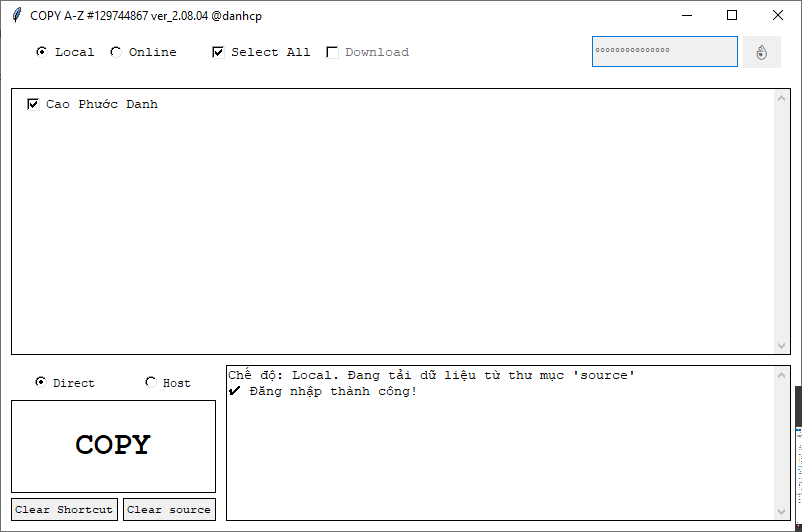

# CopyAZ v2 - Ứng dụng Sao chép & Bảo mật Dữ liệu Đa Năng

CopyAZ v2 là ứng dụng Python mạnh mẽ giúp sao chép, mã hóa và ẩn dữ liệu với giao diện trực quan, dễ sử dụng. Ứng dụng nay hỗ trợ nhiều tùy chọn nguồn dữ liệu và phương thức thực thi, đảm bảo dữ liệu của bạn được bảo vệ và truy cập linh hoạt.

## Ảnh minh họa (Screenshots / Demo)


## Tính năng chính
- **Hỗ trợ đa nguồn dữ liệu:**
  - **Local:** Sao chép và mã hóa thư mục từ thư mục `source/` cục bộ.
  - **Online:** Tải và xử lý dữ liệu từ một server từ xa (yêu cầu `CopyAZServer.py` đang hoạt động và có kết nối mạng).
- **Hỗ trợ đa phương thức thực thi:**
  - **Direct:** Tạo shortcut trỏ trực tiếp đến file HTML đã mã hóa (mở bằng trình duyệt mặc định).
  - **Host:** Tạo shortcut trỏ đến một web server cục bộ (`wb.exe`) được sao chép cùng với dữ liệu, giúp phục vụ file HTML một cách độc lập và an toàn hơn.
- **Mã hóa & Ẩn dữ liệu:**
  - Tên file và thư mục được mã hóa bằng MD5, làm cho chúng khó nhận diện.
  - Tạo cấu trúc thư mục sâu và hàng trăm thư mục giả (decoy) để làm nhiễu, tăng độ khó phát hiện dữ liệu thật.
  - Ẩn toàn bộ dữ liệu đã sao chép bằng thuộc tính hệ thống (hidden attribute) trên Windows.
  - Dữ liệu được lưu trữ ở vị trí ẩn trong `%LOCALAPPDATA%` với tên ngẫu nhiên.
- **Tạo shortcut tự động trên Desktop (Windows):** Giúp truy cập nhanh file đã mã hóa.
- **Dọn dẹp toàn diện:** Chức năng xóa shortcut và xóa toàn bộ dữ liệu đã tạo, bao gồm cả việc dừng các tiến trình web server (`wb.exe`) đang chạy.
- **Giao diện Tkinter:** Đơn giản, dễ dùng, có log hoạt động trực tiếp.
- **Cấu hình linh hoạt (F6):** Nhấn phím `F6` để mở cửa sổ cấu hình, cho phép chỉnh sửa trực tiếp các tham số trong file `config.dat` đã được mã hóa.

## Yêu cầu
- **Python:** 3.13 trở lên.
- **Hệ điều hành:** Windows 10/11 (Các tính năng chính như tạo shortcut, ẩn file, chế độ Host hoạt động tốt nhất trên Windows).
- **Thư viện Python:** `pywin32`, `requests`, `cryptography`, `flask`, `waitress`, `Pillow`, `pyperclip`.
- **File thực thi `wb.exe`:** (Chỉ cần cho chế độ thực thi Host) File này phải được đặt cùng thư mục với `CopyAZ.py`.

## Cài đặt & Sử dụng

### Chạy từ mã nguồn:
1.  **Clone repository:**
    ```bash
    git clone https://github.com/caophuocdanh/copyaz-v2.git
    cd copyaz-v2
    ```
2.  **Cài đặt các thư viện cần thiết:**
    ```bash
    pip install -r requirements.txt
    ```
3.  **Chuẩn bị thư mục `source`:**
    - Tạo một thư mục có tên `source` trong thư mục gốc của dự án.
    - Đặt các thư mục dự án (mỗi thư mục chứa một file `.html`) vào bên trong thư mục `source`.
4.  **Chạy ứng dụng:**
    ```bash
    python CopyAZ.py
    ```

### Chạy Server (cho chế độ Online):
1.  Trên máy chủ, đảm bảo đã cài đặt các thư viện trong `requirements.txt`.
2.  Đặt các thư mục dự án vào thư mục `source` trên máy chủ.
3.  Chạy server:
    ```bash
    python CopyAZServer.py
    ```
4.  Trên máy khách, chạy `CopyAZ.py`, chọn chế độ "Online" và thực hiện sao chép. (Lưu ý: Nhấn F6 để cấu hình thông tin server nếu cần).

### Build file `.exe` (Windows):
- Chạy file `build.cmd` để tạo file `CopyAZ.exe` trong thư mục `dist/`.
- **Lưu ý:** Nếu sử dụng chế độ Host, bạn cần đảm bảo file `wb.exe` cũng nằm cùng thư mục với file `CopyAZ.exe` khi chạy.

## Tác giả / Liên hệ (Author / Contact)
- **Tác giả:** Cao Phuoc Danh
- **GitHub:** [caophuocdanh](https://github.com/caophuocdanh)